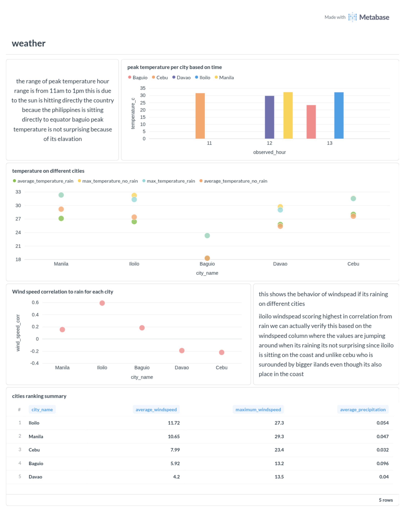

# PH Weather Pulse

A data engineering pipeline that collects real-time weather observations from five major Philippine cities, stores and transforms the data using a modular stack, and surfaces insights through a live dashboard. The project is actively in development and planned for migration to Snowflake as the cloud data warehouse.

---

## Status

**In Development — Snowflake Migration In Progress.** The local pipeline (ingestion, transformation, visualization) is fully operational. Snowflake integration is actively underway: transfer scripts have been written and tested against a live Snowflake account.

---

## Overview

PH Weather Pulse ingests hourly weather readings — temperature, precipitation, and wind speed — from the [Open-Meteo](https://open-meteo.com/) API for the following cities:

| City    | Latitude  | Longitude  |
|---------|-----------|------------|
| Manila  | 14.5995   | 120.9842   |
| Cebu    | 10.3157   | 123.8854   |
| Davao   | 7.1907    | 125.4553   |
| Baguio  | 16.4023   | 120.5960   |
| Iloilo  | 10.7202   | 122.5621   |

---

## Tech Stack

| Layer              | Technology                              |
|--------------------|-----------------------------------------|
| Orchestration      | Apache Airflow 2.10.4                   |
| Data Ingestion     | Python 3 (`requests`, `psycopg2`)       |
| Data Storage       | PostgreSQL 15 (Dockerized)              |
| Transformation     | dbt Core (`dbt-postgres`)               |
| Visualization      | Metabase v0.51.4                        |
| Containerization   | Docker + Docker Compose                 |
| Cloud Warehouse    | Snowflake *(migration in progress)*     |

---

## Pipeline Architecture

```
Open-Meteo API
      |
      v
[Airflow DAG]  (scheduled hourly)
      |
      v
[Python Script: get_data.py]
  - Fetches current weather per city
  - Retries with exponential backoff (up to 3 attempts)
  - Upserts records into PostgreSQL raw schema
      |
      v
[PostgreSQL: raw.weather_observations]
  - Stores raw JSON payload + parsed fields
  - Unique constraint on (lat, lon, observed_at, source)
      |
      v
[dbt: staging model (stg_data)]
  - Cleans and standardizes column names
  - Extracts observed_hour and observed_date
  - Filters out rows with null city_name
      |
      v
[Metabase Dashboard]
  - Reads from dbt staging views
  - Displays temperature, wind, and precipitation charts
```

The Airflow DAG chains the two steps in sequence:

```
scrape_and_load  >>  dbt_run
```

If the scrape step fails, the dbt run is skipped. Airflow retries failed tasks up to two times with a five-minute delay between attempts.

---

## Project Structure

```
ph-weather_pulse/
├── dags/
│   └── weather_scrape_dag.py       # Airflow DAG definition
├── scripts/
│   ├── get_data.py                 # API ingestion and DB insert logic
│   ├── transfer_to_snowflake.py    # Bulk transfer: staging view → Snowflake
│   └── single_transfer.py         # Upsert transfer: last 5 rows → Snowflake (MERGE)
├── weather_dbt/
│   ├── models/
│   │   └── staging/
│   │       ├── stg_data.sql        # Staging transformation model
│   │       └── sources.yml         # Source definition + freshness checks
│   ├── dbt_project.yml
│   └── profiles.yml
├── init/                           # SQL scripts run on Postgres first boot
├── findings/
│   └── Metabase - weather.pdf      # Exported dashboard with analysis
├── notes/
│   └── docker-postgres-setup-notes.md
├── schema_baseline_20260709.sql    # Point-in-time DB schema snapshot
├── .env                            # Local dev environment variables (see note below)
├── Dockerfile                      # Custom Airflow image with dbt installed
├── docker-compose.yml              # All services defined here
└── test_api.py                     # API response validation tests
```

---

## Database Schema

The raw layer uses a single table with a conflict-safe upsert pattern:

```sql
CREATE TABLE raw.weather_observations (
    id               BIGINT GENERATED ALWAYS AS IDENTITY PRIMARY KEY,
    city_name        TEXT,
    latitude         NUMERIC(9,6)  NOT NULL,
    longitude        NUMERIC(9,6)  NOT NULL,
    observed_at      TIMESTAMPTZ   NOT NULL,
    temperature_c    NUMERIC(5,2),
    precipitation_mm NUMERIC(6,2),
    wind_speed_kmh   NUMERIC(5,2),
    raw_payload      JSONB,
    source_name      TEXT NOT NULL DEFAULT 'open-meteo',
    ingested_at      TIMESTAMPTZ NOT NULL DEFAULT now(),
    batch_id         UUID,
    CONSTRAINT uq_weather_obs UNIQUE (latitude, longitude, observed_at, source_name)
);
```

The upsert guarantees that re-running the pipeline for the same time slot updates the existing record rather than creating a duplicate.

---

## Services

Four Docker containers are managed through a single `docker-compose.yml`. All credentials and configuration are read from the root `.env` file at startup.

| Container          | Image                           | Purpose                                            | Port        | Resource Limit  |
|--------------------|---------------------------------|----------------------------------------------------|-------------|-----------------|
| `weather_data`     | `postgres:15`                   | Stores all weather observations                    | `5433:5432` | 512 MB / 1 CPU  |
| `airflow_metadata` | `postgres:15`                   | Stores Airflow's internal run history and state    | Internal    | 512 MB / 1 CPU  |
| `airflow`          | Custom (Airflow + dbt)          | Runs and schedules the pipeline                    | `8080:8080` | 2 GB / 2 CPUs   |
| `metabase_app`     | `metabase/metabase:v0.51.4`     | Dashboard and visualization layer                  | `3000:3000` | 1 GB / 1 CPU    |

All services are connected on a shared Docker bridge network (`weather_net`) and include healthchecks. The `airflow` service waits for both Postgres containers to pass their healthchecks before starting. Metabase waits for `postgres_weather` to be healthy and uses it as its own application database backend (`MB_DB_*` variables), ensuring its metadata survives container restarts via a named volume.

---

## Environment Variables

> **Note on `.env` visibility:** The root `.env` file is intentionally committed to version control. It contains only the default credentials used for this local development stack — no production secrets or sensitive data. This is a deliberate choice to make the project immediately runnable after cloning without any manual configuration.
>
> The only file excluded from version control is `scripts/.env`, which holds actual Snowflake credentials and is listed in `.gitignore`.

The root `.env` file is read automatically by Docker Compose and configures all four services:

| Variable                   | Description                                    |
|----------------------------|------------------------------------------------|
| `AIRFLOW_UID`              | Host user UID for Airflow volume permissions   |
| `POSTGRES_USER`            | Weather DB username                            |
| `POSTGRES_PASSWORD`        | Weather DB password                            |
| `POSTGRES_DB`              | Weather DB name                                |
| `_AIRFLOW_WWW_USER_USERNAME` | Airflow web UI username                      |
| `_AIRFLOW_WWW_USER_PASSWORD` | Airflow web UI password                      |
| `AIRFLOW_POSTGRES_USER`    | Airflow metadata DB username                   |
| `AIRFLOW_POSTGRES_PASSWORD`| Airflow metadata DB password                   |
| `AIRFLOW_POSTGRES_DB`      | Airflow metadata DB name                       |
| `MB_DB_DBNAME`             | Metabase backend DB name                       |
| `MB_DB_PORT`               | Metabase backend DB port                       |
| `MB_DB_USER`               | Metabase backend DB username                   |
| `MB_DB_PASS`               | Metabase backend DB password                   |
| `MB_DB_HOST`               | Metabase backend DB host (container name)      |

---

## Setup

### Prerequisites

- Docker Engine and Docker Compose plugin installed
- Git
- A Unix shell (Linux or macOS)

### Step 1 — Clone the Repository

```bash
git clone <your-repo-url>
cd ph-weather_pulse
```

The `.env` file is included in the repository with working defaults for the local dev stack. No manual configuration is required to get started.

### Step 2 — Start All Services

```bash
docker compose up -d
```

Docker will pull the required images, build the custom Airflow image, and start all four containers. Allow roughly one to two minutes for Airflow and Metabase to fully initialize.

### Step 3 — Verify Containers Are Running

```bash
docker compose ps
```

All four services should show a status of `running` or `healthy`.

### Step 4 — Access the Services

| Service  | URL                       | Default Credentials          |
|----------|---------------------------|------------------------------|
| Airflow  | http://localhost:8080     | `admin` / `1234`             |
| Metabase | http://localhost:3000     | Set up on first visit        |

### Step 5 — Enable the DAG

Open the Airflow UI, find the `weather_scrape_and_load` DAG, and toggle it on. It will run immediately and then repeat every hour.

### Step 6 — Connect Metabase to PostgreSQL

In Metabase, add a new database connection with these settings:

| Field    | Value              |
|----------|--------------------|
| Type     | PostgreSQL         |
| Host     | `postgres_weather` |
| Port     | `5432`             |
| Database | `weather_db`       |
| Username | `weather_user`     |
| Password | `weather_pass`     |

> Note: Use the container name `postgres_weather` as the host (not `localhost`), since Metabase communicates with it over Docker's internal network.

### Stopping the Stack

```bash
# Stop containers, preserve data
docker compose down

# Stop containers AND delete all stored data
docker compose down -v
```

---

## dbt Transformation

The staging layer is materialized as a view in the `staging` schema. It performs the following transformations on the raw table:

- Renames and selects only the columns needed for analysis
- Extracts `observed_hour` from the timestamp for time-of-day analysis
- Derives `observed_date` from the timestamp for daily aggregation
- Excludes records where `city_name` is null

Freshness alerts are configured in `sources.yml`: a warning is raised if data is more than two hours old, and an error is raised after six hours.

To run dbt transformations manually:

```bash
docker exec -it airflow bash
cd /opt/airflow/weather_dbt
dbt run
dbt test
```

---

## Snowflake Transfer

Two scripts handle the transfer of transformed data from the local PostgreSQL staging layer to Snowflake:

### `transfer_to_snowflake.py` — Bulk Transfer

Reads the full `staging.stg_data` view from PostgreSQL and writes it directly to the `STG_DATA` table in Snowflake using `write_pandas`. Intended for an initial or full-refresh load.

```bash
cd scripts
python transfer_to_snowflake.py
```

### `single_transfer.py` — Upsert Transfer

Fetches only the latest five records and performs a `MERGE` into Snowflake's `STG_DATA` table, updating existing rows on `(OBSERVED_HOUR, CITY_NAME)` and inserting new ones. This is the incremental pattern that will be used for ongoing sync.

```bash
cd scripts
python single_transfer.py
```

Both scripts read Snowflake credentials from `scripts/.env`:

| Variable      | Description                       |
|---------------|-----------------------------------|
| `SNOW_USER`   | Snowflake username                |
| `SNOW_PASS`   | Snowflake password                |
| `SNOW_ACC`    | Account identifier (e.g. `abc123.ap-southeast-7.aws`) |
| `SNOW_WH`     | Virtual warehouse name            |
| `SNOW_DB`     | Target database                   |
| `SNOW_SCHEMA` | Target schema (e.g. `staging`)    |

> `scripts/.env` is excluded from version control via `.gitignore`. This is where actual Snowflake credentials live and should never be committed.

---

## Findings

The dashboard was built in Metabase using data collected from the staging layer.



### Peak Temperature Hours (11 AM to 1 PM)

Peak temperatures across all five cities consistently occur between 11 AM and 1 PM. This aligns with the Philippines' geographic position near the equator, where the sun reaches near-vertical angles during midday. Baguio records significantly lower peak temperatures than the other cities due to its high elevation of approximately 1,500 meters above sea level.

### Temperature With and Without Rain

The scatter plot comparing average and maximum temperatures under rainy and dry conditions shows that rainfall generally corresponds to a slight reduction in maximum temperature. Iloilo and Manila both show higher average temperatures during dry conditions, while Baguio's temperature ceiling is notably lower regardless of rainfall.

### Wind Speed and Rain Correlation

Iloilo shows the highest positive correlation between wind speed and rainfall among all five cities. This is consistent with its coastal location on the western Visayas, where wind patterns shift noticeably during rain events. Cebu, also coastal but sheltered by surrounding larger islands, shows a negative correlation, indicating that its rain events are not strongly associated with increased surface wind.

### City Rankings by Wind and Precipitation

| Rank | City   | Avg Wind Speed (km/h) | Max Wind Speed (km/h) | Avg Precipitation (mm) |
|------|--------|-----------------------|-----------------------|------------------------|
| 1    | Iloilo | 11.72                 | 27.3                  | 0.054                  |
| 2    | Manila | 10.65                 | 29.3                  | 0.047                  |
| 3    | Cebu   | 7.99                  | 23.4                  | 0.032                  |
| 4    | Baguio | 5.92                  | 13.2                  | 0.096                  |
| 5    | Davao  | 4.20                  | 13.5                  | 0.040                  |

Iloilo leads in average wind speed. Manila records the highest single maximum wind speed reading in the dataset. Baguio has the highest average precipitation rate despite its lower wind speeds, reflecting its mountainous rainfall patterns.

---

## Roadmap

- [x] API ingestion with retry logic
- [x] Dockerized PostgreSQL storage
- [x] Airflow scheduling (hourly)
- [x] dbt staging transformation layer
- [x] Metabase dashboard with initial findings
- [x] Externalize all service credentials to `.env`
- [x] Resource limits and healthchecks on all containers
- [x] Metabase pinned to stable version with persistent backend DB
- [/] Snowflake integration — transfer scripts written and tested
- [ ] Automate Snowflake sync via Airflow DAG
- [ ] dbt models targeting Snowflake schemas
- [ ] Historical backfill of weather data
- [ ] Expanded city coverage
- [ ] dbt tests and data quality checks

---

## Notes and References

- Setup details, Docker commands, and PostgreSQL references are documented in [`notes/docker-postgres-setup-notes.md`](notes/docker-postgres-setup-notes.md)
- Weather data is sourced from the [Open-Meteo API](https://open-meteo.com/), which provides free, no-authentication access to current and forecast weather
- The schema snapshot `schema_baseline_20260709.sql` represents the database structure as of July 9, 2026
